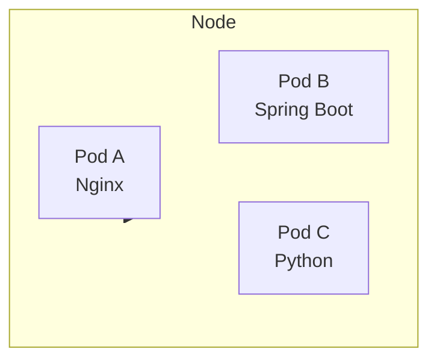
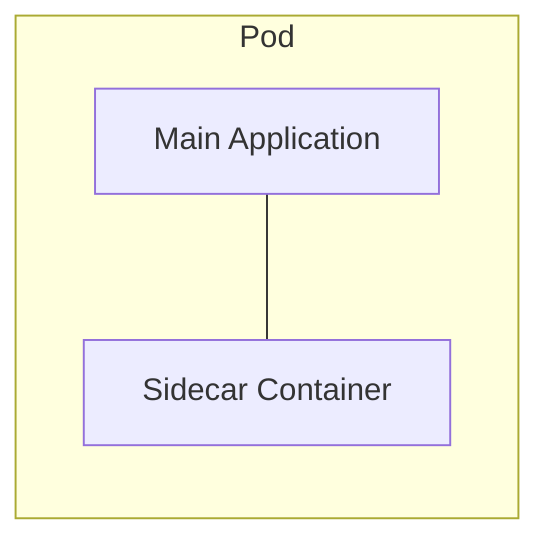
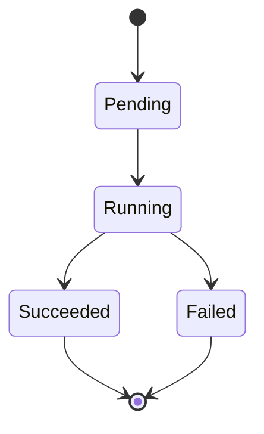

# Kubernetes Pods - Complete Guide

## What Problem Do Pods Solve?

Before Kubernetes, applications were deployed directly as containers on servers. As the number of containers increased, managing networking, communication, storage, scaling, and recovery became difficult.

Kubernetes introduced Pods as an abstraction layer to simplify container management.

---

# What is a Pod?

A Pod is the smallest deployable unit in Kubernetes.

It is a logical wrapper around one or more containers and represents a running instance of an application in the cluster.

A Pod can contain:

* One Container (Most Common)
* Multiple Containers (Advanced Use Cases)

Kubernetes does not deploy containers directly. Instead, containers are always deployed inside a Pod.

```text
Pod
└── Container
```

Every Pod provides:

* Unique IP Address
* Network Namespace
* Storage Resources
* Shared Execution Environment
---

# Why Not Deploy Containers Directly?

Imagine running thousands of containers across multiple servers in a production environment. While containers solve application packaging and portability problems, managing them individually at scale introduces several operational challenges.

Challenges include:

- Port conflicts between containers running on the same host
- Complex network management across multiple servers
- Service discovery for locating and communicating with applications
- Managing communication between related containers
- Scaling applications efficiently across the cluster

For example, if multiple containers expose the same application port (such as 8080), Kubernetes needs a way to isolate them without causing conflicts. Similarly, applications often need to communicate with other services, databases, or monitoring components, making networking and service discovery increasingly complex as the number of containers grows.

Pods solve these challenges by acting as a logical wrapper around containers. They provide a dedicated network identity, shared resources, simplified communication, and a consistent deployment unit that Kubernetes can efficiently schedule, manage, and scale across the cluster.

---

# Pod Architecture

A Kubernetes cluster consists of one or more Nodes, and each Node can run multiple Pods. A Pod serves as the execution environment for one or more containers and acts as the unit that Kubernetes schedules onto a Node.

```text
Node
│
├── Pod A
│     └── Nginx Container
│
├── Pod B
│     └── Spring Boot Container
│
└── Pod C
      └── Python Container
```



When Kubernetes schedules an application, it places the Pod onto a suitable Node based on available resources and scheduling requirements. Multiple Pods can run on the same Node while remaining isolated from each other.

Each Pod receives its own set of resources and runtime configurations, allowing it to operate independently within the cluster.

Every Pod gets:

- Unique IP Address
- Network Namespace
- Storage Resources
- Hostname

This architecture enables Kubernetes to efficiently manage application deployment, networking, scaling, and recovery across the cluster.

---

# Pod IP Address

Every Pod in Kubernetes gets its own unique IP address. This allows Pods to communicate with each other directly without requiring port mappings or complex network translations.

Example:

```text
Pod A → 10.1.0.5:8080

Pod B → 10.1.0.6:8080

Pod C → 10.1.0.7:8080
```

Since each Pod has a unique IP address, multiple Pods can run applications on the same port without causing conflicts.

For example:

```text
Pod A → 10.1.0.5:8080

Pod B → 10.1.0.6:8080

Pod C → 10.1.0.7:8080
```

All three Pods are using port `8080`, but Kubernetes can distinguish them using their unique IP addresses.

This networking model simplifies communication within the cluster because every Pod is treated as a separate network endpoint and can be reached using its IP address or through a Kubernetes Service.

---

# Single Container Pod

A Single Container Pod is the most common Pod configuration used in Kubernetes. In this model, a Pod contains only one application container, making it simple to deploy, manage, and scale.

```text
Pod
└── Nginx Container
```

Since a Pod is the smallest deployable unit in Kubernetes, even a single container must run inside a Pod. Kubernetes never deploys containers directly.

Most production applications use a Single Container Pod because each Pod is responsible for running a single application or service. This follows the principle of keeping workloads isolated, easier to manage, and independently scalable.

Common examples include:

- Nginx Web Server
- Node.js Applications
- Spring Boot Applications
- Python Applications
- Golang Microservices
- Java Applications

Benefits of Single Container Pods:

- Simpler architecture and troubleshooting
- Easier scaling and deployment
- Better resource management
- Independent lifecycle management
- Follows the one application per Pod best practice

For most real-world Kubernetes deployments, a Single Container Pod is the recommended and preferred approach unless there is a specific requirement for multiple tightly coupled containers to run together.

---

# Multi Container Pod

A Pod can contain multiple containers when those containers need to work closely together and share the same execution environment. This is known as a Multi Container Pod.

```text
Pod
├── Application Container
└── Logging Container
```

Unlike containers running in separate Pods, containers inside the same Pod are tightly coupled and are treated as a single unit by Kubernetes.

These containers share:

- Network
- Storage
- Lifecycle

Because they share the same network namespace, all containers inside the Pod can communicate with each other using `localhost`.

For example:

```text
Application Container  → localhost:8080

Logging Container      → localhost:8080
```

Multi Container Pods are commonly used when one container extends or supports the functionality of another container.

Common examples include:

- Application Container + Logging Agent
- Application Container + Monitoring Agent
- Application Container + Proxy Container
- Application Container + Security Agent

Since all containers in the Pod are scheduled together on the same Node and share resources, they can communicate efficiently without requiring external networking.

Multi Container Pods should be used only when containers are tightly coupled and must operate together. Otherwise, deploying containers in separate Pods is generally the preferred approach.

---

# Sidecar Pattern

The Sidecar Pattern is one of the most common and widely used Multi Container Pod patterns in Kubernetes. In this approach, a secondary container, known as a sidecar, runs alongside the main application container within the same Pod.

```text
Pod
├── Main Application
└── Sidecar Container
```



The sidecar container is not responsible for serving business logic. Instead, it provides supporting functionality that helps the main application operate more effectively.

Since both containers run inside the same Pod, they share:

- Network Namespace
- Pod IP Address
- Storage Volumes
- Lifecycle

This allows the sidecar container to communicate with the main application using `localhost` and access shared data without requiring external networking.

Common Sidecar use cases include:

- Log Collection and Forwarding
- Monitoring and Metrics Collection
- Security and Policy Enforcement
- Request Routing and Proxying
- Configuration Synchronization

Common Sidecar Containers:

- Fluentd
- Log Collectors
- Monitoring Agents
- Security Agents

Real-World Example:

```text
Pod
├── Spring Boot Application
└── Fluentd Sidecar
```

In this setup, the Spring Boot application generates logs, while the Fluentd sidecar continuously collects and forwards those logs to a centralized logging system such as Elasticsearch or Splunk.

The Sidecar Pattern helps keep application code clean by moving supporting responsibilities such as logging, monitoring, and security into dedicated containers while allowing them to operate closely with the main application.

---
# Communication Inside a Pod

Containers running inside the same Pod can communicate with each other using:

```bash
localhost
```

This is possible because all containers within a Pod share the same network namespace and IP address.

For example:

```text
Pod
├── Application Container  → localhost:8080
└── Logging Container      → localhost:8080
```

Instead of communicating over external networks, containers can directly access each other through `localhost`, making communication fast and efficient.

Containers inside the same Pod share:

- Network Namespace
- IP Address
- Port Space

As a result, if one container exposes an application on a specific port, other containers within the same Pod can access it using:

```bash
localhost:<port>
```

Example:

```bash
localhost:8080
```

This shared networking model is one of the key reasons why tightly coupled containers, such as sidecars, are deployed together within the same Pod.

---

# Pod Networking

Kubernetes follows a **Pod-to-Pod networking model**, where every Pod receives its own unique IP address. This allows Pods to communicate with each other directly, regardless of which Node they are running on.

```text
Node
│
├── Pod A → 10.1.0.5
├── Pod B → 10.1.0.6
└── Pod C → 10.1.0.7
```

Because each Pod has a unique IP address, Kubernetes treats every Pod as an independent network endpoint within the cluster.

## Communication Rules

### Same Pod

Containers running inside the same Pod communicate using:

```bash
localhost
```

Since they share the same network namespace, IP address, and port space, communication is fast and does not require external networking.

### Different Pods

Pods communicate with each other using:

```bash
Pod IP
```

Example:

```text
Pod A (10.1.0.5) → Pod B (10.1.0.6)
```

However, Pod IP addresses can change when Pods are recreated or rescheduled.

For this reason, applications typically communicate through a Kubernetes Service instead of directly using Pod IPs.

```bash
Kubernetes Service
```

A Service provides a stable network endpoint and automatically routes traffic to the appropriate Pods, even when Pod IP addresses change.

This networking model enables seamless communication between applications while allowing Kubernetes to handle scheduling, scaling, and recovery behind the scenes.

---

# Pause Container

Every Pod in Kubernetes contains a special container called the **Pause Container**. Although it is not visible during normal application development, it plays a critical role in Pod networking and lifecycle management.

```text
Pod
├── Pause Container
├── Application Container
└── Logging Container
```

The Pause Container is created first whenever a Pod starts. It acts as the parent container for all other containers within the Pod and provides the shared environment that they use.

The Pause Container:

- Creates the Network Namespace
- Holds the Pod IP Address
- Maintains Pod Networking

All application containers inside the Pod join the network namespace created by the Pause Container. As a result, they share the same:

- IP Address
- Network Interfaces
- Port Space

This is why containers within the same Pod can communicate using:

```bash
localhost
```

Without the Pause Container, every application container would need its own network namespace and IP address, making Pod-level networking impossible.

The Pause Container also helps maintain the Pod's network identity. Even if an application container crashes and restarts, the Pod's networking remains intact because the Pause Container continues running in the background.

```text
Pause Container
        │
        ├── Creates Network Namespace
        ├── Holds Pod IP
        └── Application Containers Join It
```

Although lightweight, the Pause Container is one of the most important components of Pod architecture because it enables all containers in a Pod to share a common networking environment.

---

# Why Pause Container is Important

The Pause Container plays a critical role in maintaining a Pod's network identity and shared execution environment.

Without a Pause Container, the Pod's networking would be directly tied to the application containers. If an application container crashes or restarts, the network namespace and IP address could be lost, disrupting communication with other Pods and services.

Without Pause Container:

```text
Application Crash
↓
Network Lost
↓
IP Lost
```

With a Pause Container, the Pod's network namespace remains active even if one or more application containers fail. Since the Pause Container continues running, the Pod retains its network identity while Kubernetes restarts the failed container.

With Pause Container:

```text
Application Crash
↓
Pause Container Running
↓
Network Preserved
↓
Application Restarted
```

This separation between the Pod's networking and the application containers provides stability and reliability. The Pod keeps the same network namespace, IP address, and communication channels while Kubernetes handles container recovery in the background.

As a result, application failures do not immediately impact the Pod's networking, enabling Kubernetes to deliver self-healing and seamless container restarts.

---

# Pod Lifecycle

A Pod goes through different phases during its lifetime, from creation to termination. These phases help Kubernetes track the current state of a Pod and determine whether it is running successfully or requires attention.

Typical successful lifecycle:

```text
Pending
↓
Running
↓
Succeeded
```

If something goes wrong during execution:

```text
Pending
↓
Running
↓
Failed
```



## Pod States

### Pending

The Pod has been accepted by Kubernetes but is not yet running.

Common reasons include:

- Pod is being scheduled to a Node
- Container images are being downloaded
- Required resources are not yet available

### Running

The Pod has been successfully scheduled to a Node, and one or more containers are running.

This is the normal operational state for most applications.

### Succeeded

All containers in the Pod have completed their work successfully and exited with a status code of `0`.

This state is commonly seen in:

- Batch Jobs
- Scheduled Tasks
- Data Processing Workloads

### Failed

One or more containers terminated unexpectedly or exited with a non-zero status code.

Common causes include:

- Application errors
- Configuration issues
- Missing dependencies
- Resource constraints

### Unknown

Kubernetes is unable to determine the current state of the Pod, usually due to communication issues between the control plane and the Node hosting the Pod.

## Important Note

Pods are generally considered temporary resources. If a Pod fails or is deleted, Kubernetes controllers such as Deployments or ReplicaSets can automatically create a new Pod to maintain the desired application state.

---

# Pod YAML Example

```yaml
apiVersion: v1
kind: Pod

metadata:
  name: nginx-pod

spec:
  containers:
    - name: nginx
      image: nginx
      ports:
        - containerPort: 80
```

---
# Useful Commands

The following `kubectl` commands are commonly used when working with Pods. They help create, inspect, troubleshoot, and manage Pods within a Kubernetes cluster.

## Create a Pod

Apply the Pod manifest and create the Pod in the cluster.

```bash
kubectl apply -f pod.yaml
```

This command reads the YAML file and creates the resources defined in it.

---

## View Pods

List all Pods in the current namespace.

```bash
kubectl get pods
```

Example output:

```text
NAME        READY   STATUS    RESTARTS   AGE
nginx-pod   1/1     Running   0          2m
```

To view additional details such as Pod IP and Node information:

```bash
kubectl get pods -o wide
```

---

## Describe a Pod

Display detailed information about a specific Pod.

```bash
kubectl describe pod nginx-pod
```

This command provides information such as:

- Pod status
- Container details
- IP address
- Events
- Resource configuration
- Node assignment

It is one of the most useful commands for troubleshooting Pod issues.

---

## View Pod Logs

Display logs generated by a container running inside the Pod.

```bash
kubectl logs nginx-pod
```

For Pods containing multiple containers:

```bash
kubectl logs nginx-pod -c <container-name>
```

Logs are commonly used for debugging application failures and runtime issues.

---

## Delete a Pod

Remove a Pod from the cluster.

```bash
kubectl delete pod nginx-pod
```

If the Pod is managed by a Deployment or ReplicaSet, Kubernetes will automatically create a replacement Pod to maintain the desired state.

---

## Quick Reference

| Command | Purpose |
|----------|---------|
| `kubectl apply -f pod.yaml` | Create a Pod from a YAML file |
| `kubectl get pods` | List all Pods |
| `kubectl get pods -o wide` | List Pods with additional details |
| `kubectl describe pod <pod-name>` | View detailed Pod information |
| `kubectl logs <pod-name>` | View Pod logs |
| `kubectl delete pod <pod-name>` | Delete a Pod |

---

# Interview Questions

### What is the smallest deployable unit in Kubernetes?

Pod

### Can a Pod contain multiple containers?

Yes

### Do containers inside a Pod get separate IPs?

No

### How do containers inside a Pod communicate?

localhost

### Why is Pause Container required?

To maintain Pod networking and namespace.

---

# Summary

- Kubernetes deploys and manages Pods, not individual containers.
- A Pod is the smallest deployable unit in Kubernetes.
- Every Pod receives its own unique IP address and network identity.
- Containers within the same Pod communicate using `localhost` because they share the same network namespace.
- Pods can contain a single container or multiple tightly coupled containers.
- Multi Container Pods are commonly used to implement patterns such as the Sidecar Pattern.
- Every Pod contains a hidden Pause Container that maintains the Pod's network namespace and IP address.
- Pods follow a lifecycle that includes states such as Pending, Running, Succeeded, Failed, and Unknown.
- Kubernetes uses Pods as the unit for scheduling, scaling, networking, and recovery.

Understanding Pods is essential because nearly every Kubernetes workload—whether a Deployment, StatefulSet, DaemonSet, or Job—ultimately runs applications inside Pods.
---
---
## Connect with Shubham Gour
- YouTube: https://youtube.com/shubhamgourtech
- LinkedIn: https://www.linkedin.com/in/theshubhamgour/
- Hashtags: #theshubhamgour #shubhamgour
